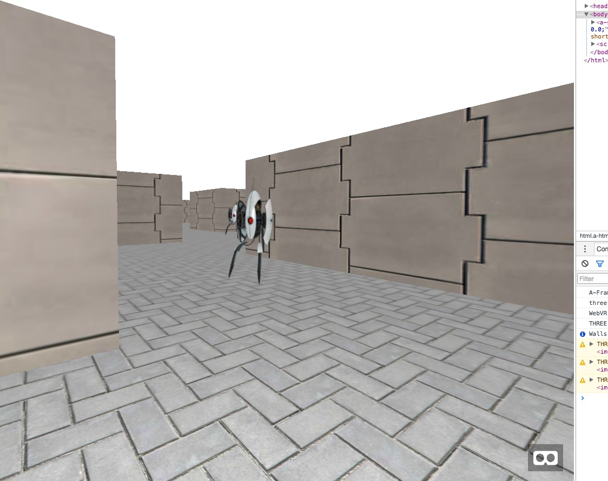

# WebVR test with [A-FRAME](https://aframe.io/docs/)

based on

* https://24ways.org/2016/first-steps-in-vr/
* https://github.com/ShaneHudson/first-steps-in-vr

assets

* https://hacks.mozilla.org/?s=webvr
* https://hacks.mozilla.org/2016/03/build-the-virtual-reality-web-with-a-frame/
* https://github.com/donmccurdy/aframe-extras/tree/master/
* https://thevrjump.com/artikel
* https://github.com/jeromeetienne/AR.js
* https://developer.oculus.com/webvr/
* https://github.com/aframevr/awesome-aframe
* https://webvr.rocks/
